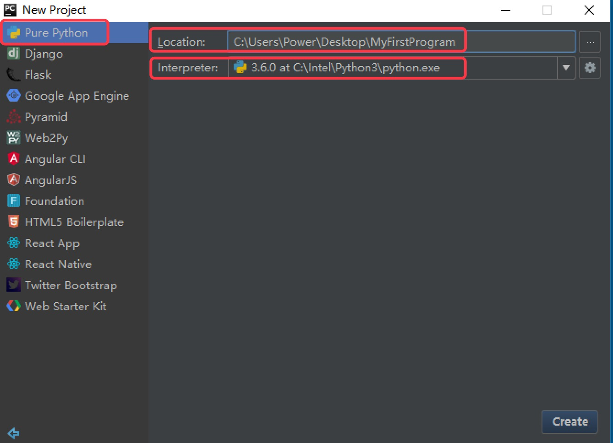
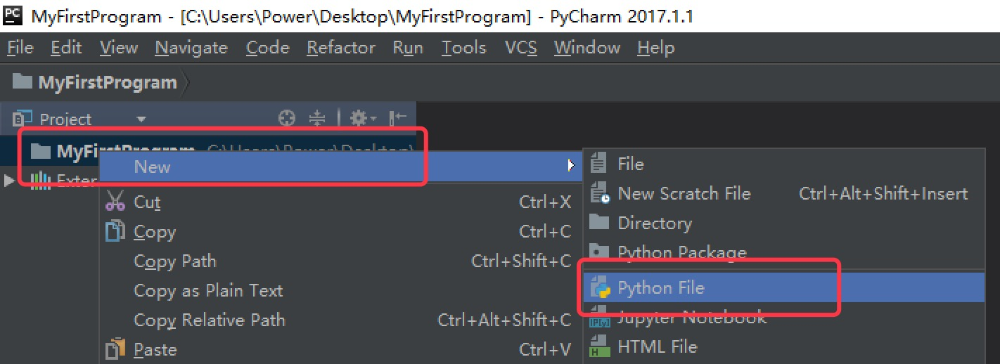
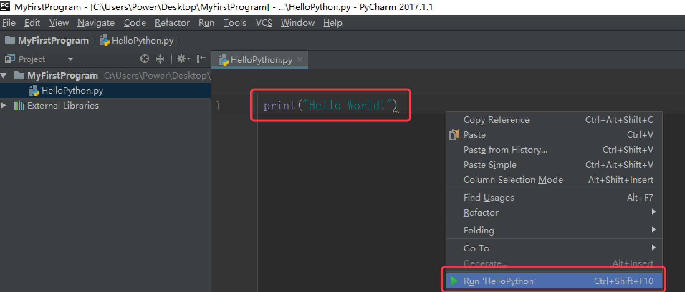
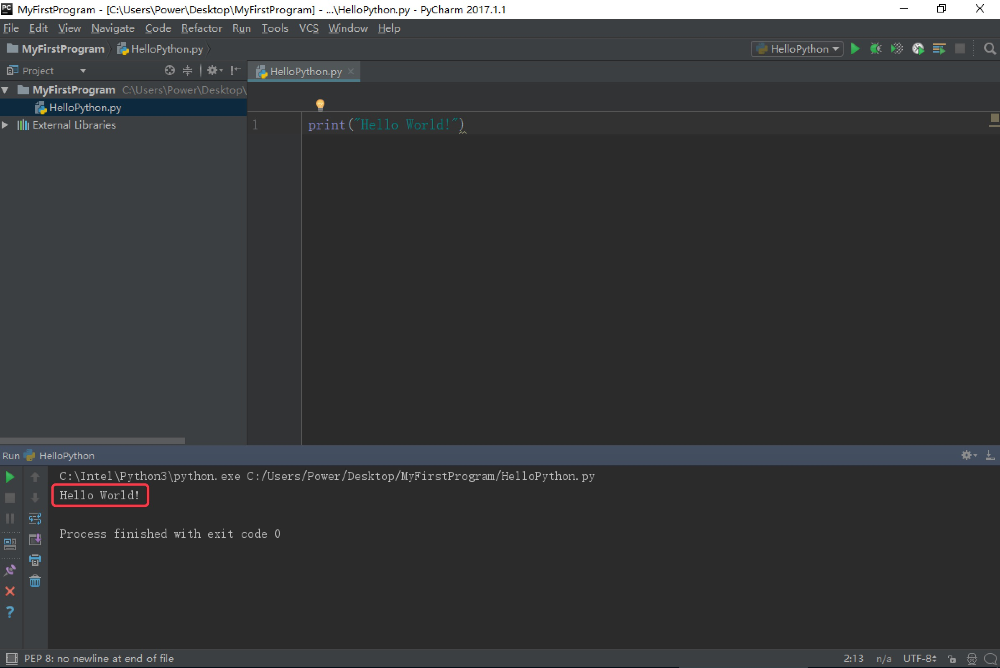

## 使用Pycharm编写第一个python程序


 1. 打开 Pycharm，选择 `Create New Project`，创建一个新项目
  

 2. 选择`Pure Python`表示创建一个纯Python程序项目, `Location` 表示该项目保存的路径，`Interpreter` 表示使用的Python解释器版本，最后点击`Create` 创建项目。

  

3. 右击项目，选择`New`，再选择`Python File`


4. 在弹出的对话框中输入的文件名HelloPython，点击`OK`，表示创建一个Python程序的文本文件，文本文件后缀名默认.py

 

5. 输入以下代码，并右击空白处，选择`Run`运行，表示打印一个字符串"Hello World!"。

    ```python
print("Hello World!")
```
   
  
6. 运行成功后，Pycharm Console窗口将显示我们的输出结果。

 


## 练一练
要求：编写一个程序，输出`itcast.cn`

