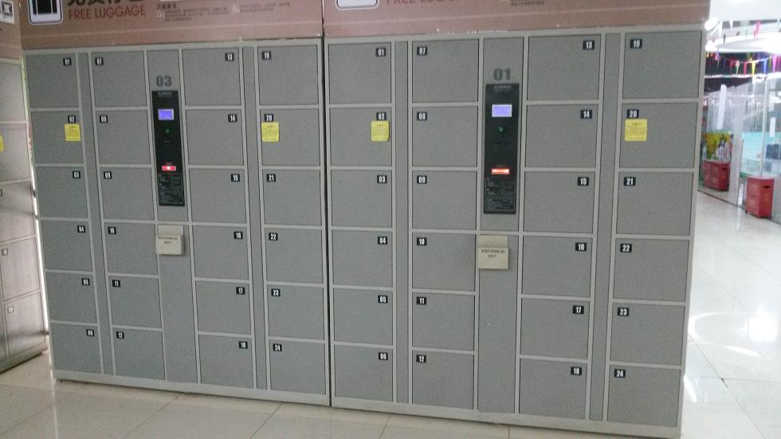
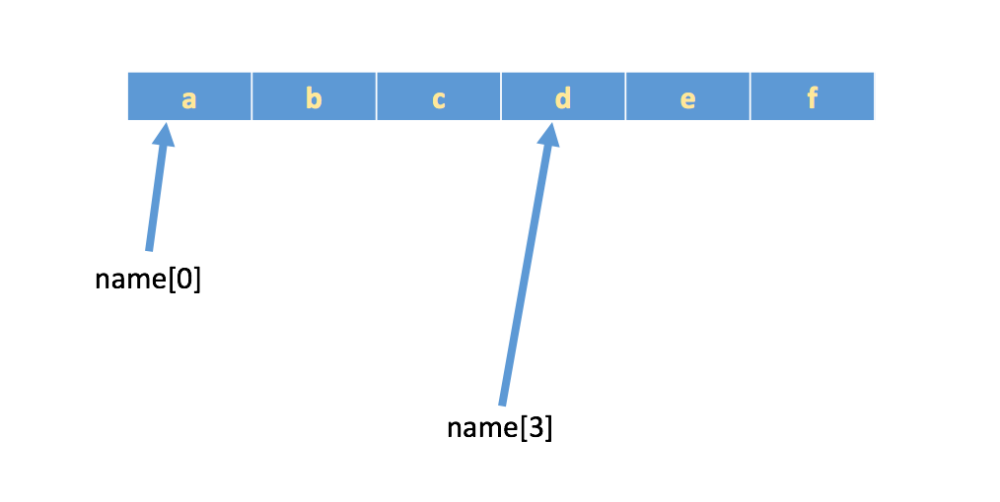
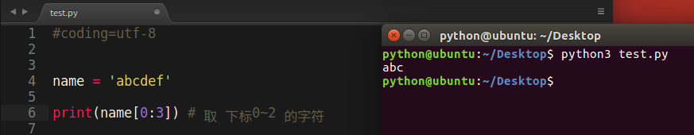
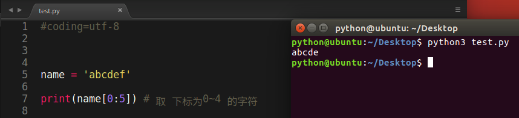
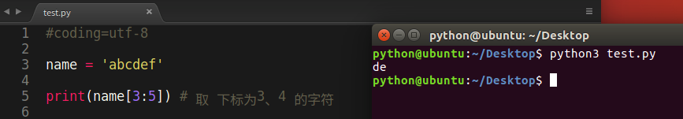
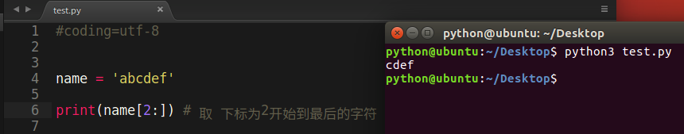
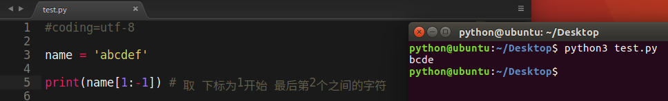

# 下标和切片

## 1. 下标索引

所谓`“下标”`，就是编号，就好比超市中的存储柜的编号，通过这个编号就能找到相应的存储空间

* 生活中的 "下标"
 
 超市储物柜
 
 
 
 高铁二等座
 
 
 
 高铁一等座
 
 
 
 绿皮车
 
 

* 字符串中"下标"的使用

 **列表与元组支持下标索引好理解，字符串实际上就是字符的数组，所以也支持下标索引。**

 如果有字符串:`name = 'abcdef'`，在内存中的实际存储如下:

 

 如果想取出部分字符，那么可以通过`下标`的方法，（注意python中下标从 0 开始）
 
 ```python

 	name = 'abcdef'

 	print(name[0])
 	print(name[1])
 	print(name[2])

 ```
 运行结果:

 ```
 a
 b
 c
 ``` 


## 2. 切片

切片是指对操作的对象截取其中一部分的操作。**字符串、列表、元组**都支持切片操作。

#### 切片的语法：[起始:结束:步长]
**注意：选取的区间从"起始"位开始，到"结束"位的前一位结束（不包含结束位本身)，步长表示选取间隔。**

我们以字符串为例讲解。

 如果取出一部分，则可以在中括号[]中，使用:
 
 ```python

 	name = 'abcdef'

 	print(name[0:3]) # 取 下标0~2 的字符
 ```
 运行结果:
 
 

 ```python

 	name = 'abcdef'

 	print(name[0:5]) # 取 下标为0~4 的字符

 ```
 运行结果:
 

 ```python

 	name = 'abcdef'

 	print(name[3:5]) # 取 下标为3、4 的字符
 ```
 运行结果:
 

 ```python

 	name = 'abcdef'

 	print(name[2:]) # 取 下标为2开始到最后的字符
 ```
 运行结果:
 

 ```python

 	name = 'abcdef'

 	print(name[1:-1]) # 取 下标为1开始 到 最后第2个  之间的字符

 ```
 运行结果:
 

 ```python
 >>> a = "abcdef"
 >>> a[:3]
 'abc'
 >>> a[::2]
 'ace'
 >>> a[5:1:2] 
 ''
 >>> a[1:5:2]
 'bd'
 >>> a[::-2]
 'fdb' 
 >>> a[5:1:-2]
 'fd'
 ```
 
### 想一想
 
 + （面试题）给定一个字符串aStr, 请反转字符串


``` python
# 索引是通过下标取某一个元素
# 切片是通过下标去某一段元素

s = 'Hello World!'

print(s[4])

print(s)

print(s[:]) # 取出所有元素（没有起始位和结束位之分），默认步长为1

print(s[1:]) # 从下标为1开始，取出 后面所有的元素（没有结束位）

print(s[:5])  # 从起始位置开始，取到 下标为5的前一个元素（不包括结束位本身）

print(s[:-1]) # 从起始位置开始，取到 倒数第一个元素（不包括结束位本身）

print(s[-4:-1]) # 从倒数第4个元素开始，取到 倒数第1个元素（不包括结束位本身）

print(s[1:5:2]) # 从下标为1开始，取到下标为5的前一个元素，步长为2（不包括结束位本身）

# python 字符串快速逆置
print(s[::-1])  # 从后向前，按步长为1进行取值
```
