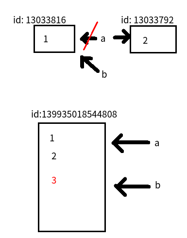

## 引用(一)

### 想一想

```python
>>> a = 1
>>> b = a
>>> b
1
>>> a = 2
>>> a
2
```
##### 请问此时b的值为多少？

```python
>>> a = [1, 2]
>>> b = a
>>> b
[1, 2]
>>> a.append(3)
>>> a
[1, 2, 3]
```
##### 请问此时b的值又是多少？

### 引用

在python中，值是靠引用来传递来的。

**我们可以用id()来判断两个变量是否为同一个值的引用。** 我们可以将id值理解为那块内存的地址标示。

```python
>>> a = 1
>>> b = a
>>> id(a) 
13033816
>>> id(b)   # 注意两个变量的id值相同
13033816
>>> a = 2
>>> id(a)   # 注意a的id值已经变了
13033792
>>> id(b)   # b的id值依旧
13033816
```

```python
>>> a = [1, 2]
>>> b = a
>>> id(a)
139935018544808
>>> id(b)
139935018544808
>>> a.append(3)
>>> a
[1, 2, 3]
>>> id(a)
139935018544808
>>> id(b)       # 注意a与b始终指向同一个地址
139935018544808
```


#### 总结：
* 之前为了更好的理解变量，咱们可以把`a=100`理解为变量a中存放了100，事实上变量a存储是100的引用（可理解为在内存中的一个编号）
