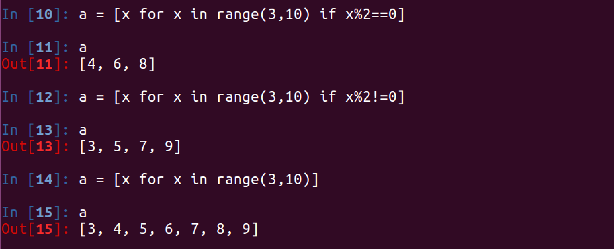
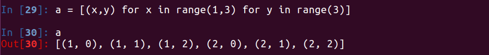
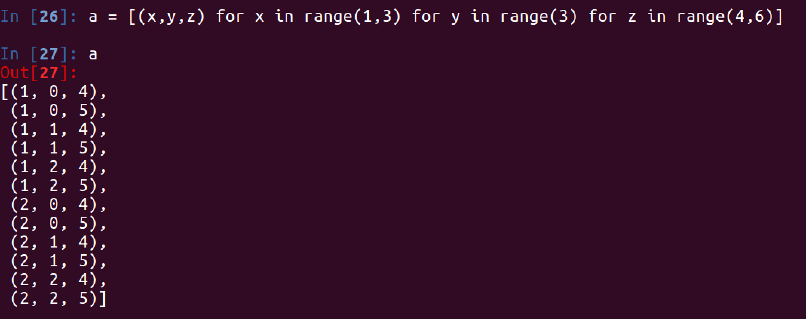

## 列表推导式

所谓的列表推导式，就是指的轻量级循环创建列表

### 1. 基本的方式


### 2. 在循环的过程中使用if


### 3. 2个for循环


### 4. 3个for循环


### 练习

请写出一段 Python 代码实现分组一个 list 里面的元素,比如 [1,2,3,...100]变成 [[1,2,3],[4,5,6]....]

参考答案：

```python
a = [x for x in range(1,101)]
b = [a[x:x+3] for x in range(0,len(a),3)]
```