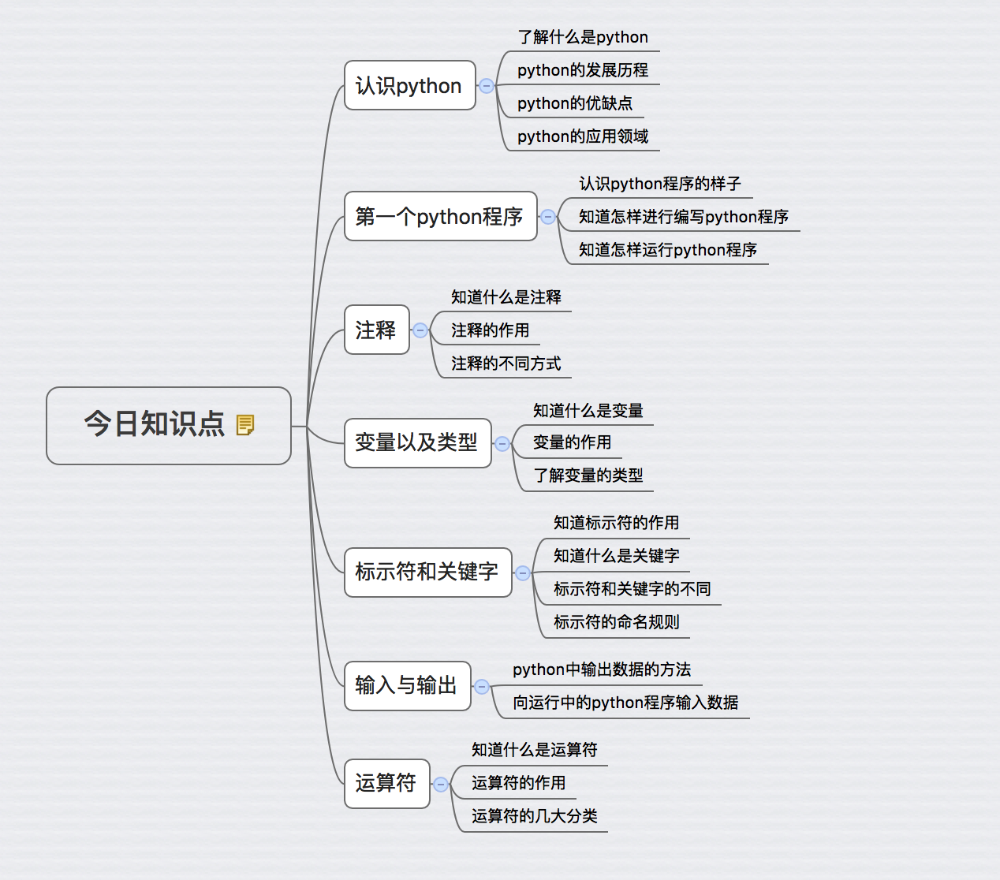

# 总结：



# 作业

## 必做题：

### 1. 说出变量名可以由哪些字符组成

### 2. 写出变量命名时的规则

### 3. 说出什么是驼峰法（大驼峰、小驼峰）

### 4. 编写程序，完成以下要求：
* 提示用户进行输入数据
* 获取用户的数据数据（需要获取2个）
* 对获取的两个数字进行求和运行，并输出相应的结果
 

### 5. 编写程序，完成以下信息的显示:

```
==================================
=		欢迎进入到身份认证系统V1.0
= 1. 登录
= 2. 退出
= 3. 认证
= 4. 修改密码
==================================
```

### 6. 编写程序，通过input()获取一个人的信息，然后按照下面格式显示

```
==================================
姓名: xxxxx	
QQ:xxxxxxx
手机号:131xxxxxx
公司地址:北京市xxxx
==================================
```

