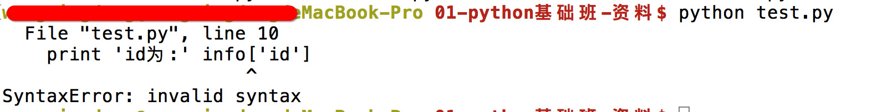
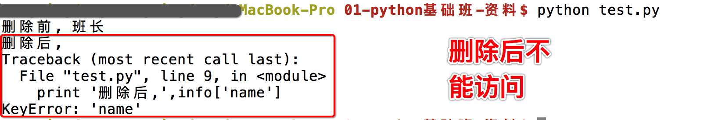
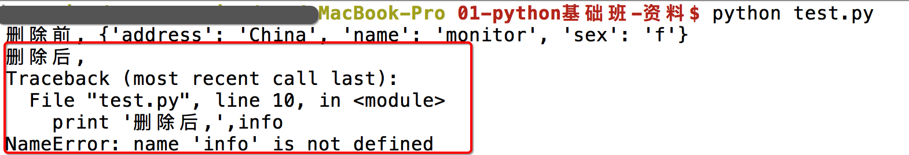

# 字典的常见操作1

## <1>查看元素
除了使用key查找数据，还可以使用get来获取数据

demo:
```python
	info = {'name':'吴彦祖','age':18}
	
	print(info['age']) # 获取年龄
	
	# print(info['sex']) # 获取不存在的key，会发生异常

	print(info.get('sex')) # 获取不存在的key，获取到空的内容，不会出现异常
```

## <2>修改元素
字典的每个元素中的数据是可以修改的，只要通过key找到，即可修改

demo:
```python 
	info = {'name':'班长', 'id':100, 'sex':'f', 'address':'地球亚洲中国北京'}

	newId = input('请输入新的学号')

	info['id'] = int(newId)

	print('修改之后的id为%d:'%info['id'])

```

结果:


## <3>添加元素

demo:访问不存在的元素
```python
	info = {'name':'班长', 'sex':'f', 'address':'地球亚洲中国北京'}

	print('id为:%d'%info['id'])
```

结果:




如果在使用  ** 变量名['键'] = 数据  **时，这个“键”在字典中，不存在，那么就会新增这个元素

demo:添加新的元素
```python
	info = {'name':'班长', 'sex':'f', 'address':'地球亚洲中国北京'}

	# print('id为:%d'%info['id'])#程序会终端运行，因为访问了不存在的键

	newId = input('请输入新的学号')

	info['id'] = newId

	print('添加之后的id为:%d'%info['id'])
```

结果:
```
	请输入新的学号188
	添加之后的id为: 188
```

## <4>删除元素

对字典进行删除操作，有一下几种：
* del
* clear()


demo:del删除指定的元素

```python

	info = {'name':'班长', 'sex':'f', 'address':'地球亚洲中国北京'}

	print('删除前,%s'%info['name'])

	del info['name']

	print('删除后,%s'%info['name'])

```
结果



demo:del删除整个字典

```python

	info = {'name':'monitor', 'sex':'f', 'address':'China'}

	print('删除前,%s'%info)

	del info

	print('删除后,%s'%info)


```
结果




demo:clear清空整个字典

```python

	info = {'name':'monitor', 'sex':'f', 'address':'China'}

	print('清空前,%s'%info)

	info.clear()

	print('清空后,%s'%info)


```
结果


