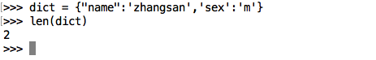
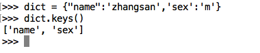
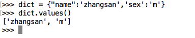
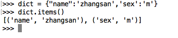
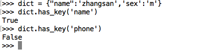

# 字典的常见操作2

### <1>len()

测量字典中，键值对的个数

### <2>keys

返回一个包含字典所有KEY的列表

### <3>values

返回一个包含字典所有value的列表

### <4>items

返回一个包含所有（键，值）元祖的列表

### <5>has_key （Python3 已取消）

dict.has_key(key)如果key在字典中，返回True，否则返回False

