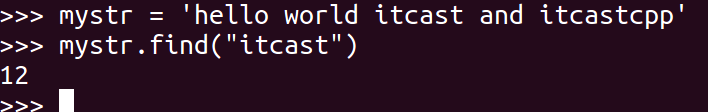
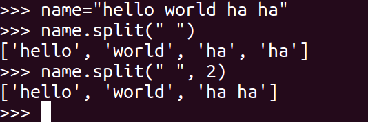
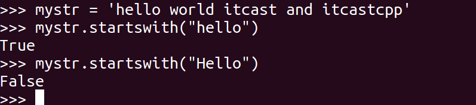
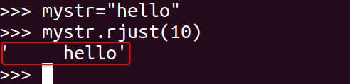
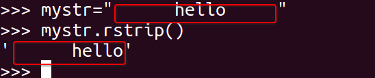
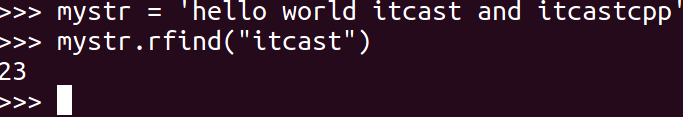

# 字符串常见操作

如有字符串`mystr = 'hello world itcast and itcastcpp'`，以下是常见的操作

#### <1>find
检测 str 是否包含在 mystr中，如果是返回开始的索引值，否则返回-1

	mystr.find(str, start=0, end=len(mystr))




#### <2>index
跟find()方法一样，只不过如果str不在 mystr中会报一个异常.

	mystr.index(str, start=0, end=len(mystr)) 


#### <3>count
返回 str在start和end之间 在 mystr里面出现的次数

	mystr.count(str, start=0, end=len(mystr))


#### <4>replace
把 mystr 中的 str1 替换成 str2,如果 count 指定，则替换不超过 count 次.

	mystr.replace(str1, str2,  mystr.count(str1))


	
#### <5>split
以 str 为分隔符切片 mystr，如果 maxsplit有指定值，则仅分隔 maxsplit 个子字符串

	mystr.split(str=" ", 2)	


	
#### <6>capitalize
把字符串的第一个字符大写

	mystr.capitalize()


#### <7>title
把字符串的每个单词首字母大写

```python
>>> a = "hello itcast"
>>> a.title()
'Hello Itcast'
```

#### <8>startswith
检查字符串是否是以 hello 开头, 是则返回 True，否则返回 False

	mystr.startswith(hello)



#### <9>endswith
检查字符串是否以obj结束，如果是返回True,否则返回 False.

	mystr.endswith(obj)


#### <10>lower
转换 mystr 中所有大写字符为小写

	mystr.lower()		


#### <11>upper
转换 mystr 中的小写字母为大写

	mystr.upper()	


#### <12>ljust
返回一个原字符串左对齐,并使用空格填充至长度 width 的新字符串

	mystr.ljust(width) 
	


#### <13>rjust
返回一个原字符串右对齐,并使用空格填充至长度 width 的新字符串

	mystr.rjust(width)	




#### <14>center
返回一个原字符串居中,并使用空格填充至长度 width 的新字符串

	mystr.center(width)   


#### <15>lstrip
删除 mystr 左边的空白字符

	mystr.lstrip()


	
#### <16>rstrip
删除 mystr 字符串末尾的空白字符

	mystr.rstrip()	



#### <17>strip
删除mystr字符串两端的空白字符

```python
>>> a = "\n\t itcast \t\n"
>>> a.strip()
'itcast'
```

### <18>rfind
类似于 find()函数，不过是从右边开始查找.

	mystr.rfind(str, start=0,end=len(mystr) )



### <19>rindex
类似于 index()，不过是从右边开始.

	mystr.rindex( str, start=0,end=len(mystr))


### <20>partition
把mystr以str分割成三部分,str前，str和str后

	mystr.partition(str)


### <21>rpartition
类似于 partition()函数,不过是从右边开始.

	mystr.rpartition(str)


	
### <22>splitlines
按照行分隔，返回一个包含各行作为元素的列表

	mystr.splitlines()  


	
### <23>isalpha
如果 mystr 所有字符都是字母 则返回 True,否则返回 False

	mystr.isalpha()  


	
### <24>isdigit
如果 mystr 只包含数字则返回 True 否则返回 False.

	mystr.isdigit() 


### <25>isalnum
如果 mystr 所有字符都是字母或数字则返回 True,否则返回 False

	mystr.isalnum()  


	
### <26>isspace
如果 mystr 中只包含空格，则返回 True，否则返回 False.

	mystr.isspace()   


### <27>join
mystr 中每个元素后面插入str,构造出一个新的字符串

	mystr.join(str)


#想一想
+ （面试题）给定一个字符串aStr，返回使用空格或者'\t'分割后的倒数第二个子串


