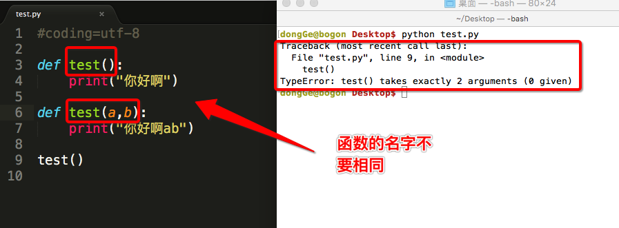
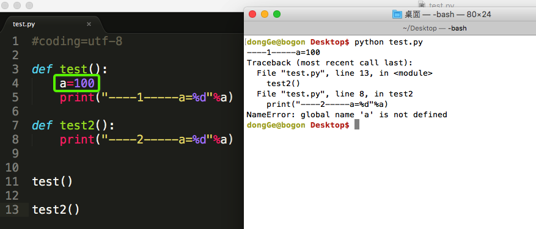

## 函数使用注意事项

### 1. 自定义函数

#### 无参数、无返回值

``` python
def 函数名():
	语句
```

#### 无参数、有返回值

```python
def 函数名():
	语句
	return 需要返回的数值
```

> 注意:
> 
>
> * 一个函数到底有没有返回值，就看有没有return，因为只有return才可以返回数据
> * 在开发中往往根据需求来设计函数需不需要返回值
> * 函数中，可以有多个return语句，但是只要执行到一个return语句，那么就意味着这个函数的调用完成

#### 有参数、无返回值
```
def 函数名(形参列表):
	语句
```

> 注意：
> * 在调用函数时，如果需要把一些数据一起传递过去，被调用函数就需要用参数来接收
> * 参数列表中变量的个数根据实际传递的数据的多少来确定

#### 有参数、有返回值
```
def 函数名(形参列表):
	语句
	return 需要返回的数值

```

#### 函数名不能重复



> * 如果在同一个程序中出现了多个相同函数名的函数，那么在调用函数时就会出现问题，所以要避免名字相同
> * 还有一点 不仅要避免函数名之间不能相同，还要避免 变量名和函数名相同的，否则都会出现问题
> * 详细的讲解在python就业班中进行学习，此阶段只要注意这些问题即可


### 2. 调用函数

#### 调用的方式为：
```
函数名([实参列表])
```

#### 调用时，到底写不写 实参
* 如果调用的函数 在定义时有形参，那么在调用的时候就应该传递参数

#### 调用时，实参的个数和先后顺序应该和定义函数中要求的一致

#### 如果调用的函数有返回值，那么就可以用一个变量来进行保存这个值


### 3. 作用域

#### 在一个函数中定义的变量，只能在本函数中用(局部变量)



#### 在函数外定义的变量，可以在所有的函数中使用(全局变量)
