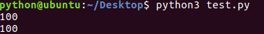
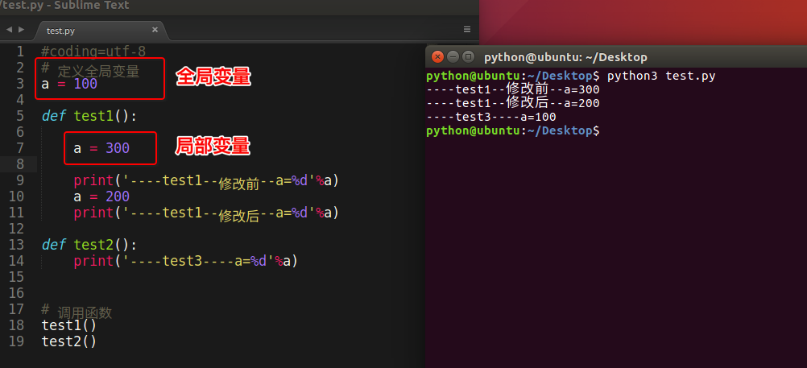

## 全局变量

### <1>什么是全局变量

如果一个变量，既能在一个函数中使用，也能在其他的函数中使用，这样的变量就是全局变量


打个比方：有2个兄弟 各自都有手机，各自有自己的小秘密在手机里，不让另外一方使用（可以理解为局部变量）；但是家里的电话是2个兄弟都可以随便使用的（可以理解为全局变量）


demo如下:
```python

# 定义全局变量
a = 100

def test1():
	print(a)  # 虽然没有定义变量a但是依然可以获取其数据

def test2():
	print(a)  # 虽然没有定义变量a但是依然可以获取其数据

# 调用函数
test1()
test2()
```

运行结果:



### 总结1:
 * 在函数外边定义的变量叫做`全局变量`
 * 全局变量能够在所有的函数中进行访问

### <2>全局变量和局部变量名字相同问题

看如下代码:



### 总结2:
 * 当函数内出现局部变量和全局变量相同名字时，函数内部中的 `变量名 = 数据` 此时理解为定义了一个局部变量，而不是修改全局变量的值

### <3>修改全局变量

函数中进行使用时可否进行修改呢？

代码如下:


### 总结3:
 * 如果在函数中出现`global 全局变量的名字` 那么这个函数中即使出现和全局变量名相同的`变量名 = 数据` 也理解为对全局变量进行修改，而不是定义局部变量
 * 如果在一个函数中需要对多个全局变量进行修改，那么可以使用
 	
 	```python
		# 可以使用一次global对多个全局变量进行声明
		global a, b
		# 还可以用多次global声明都是可以的
		# global a
		# global b

 	```
