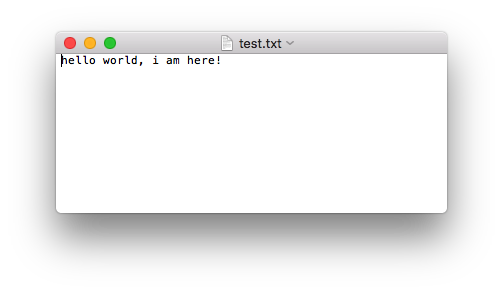
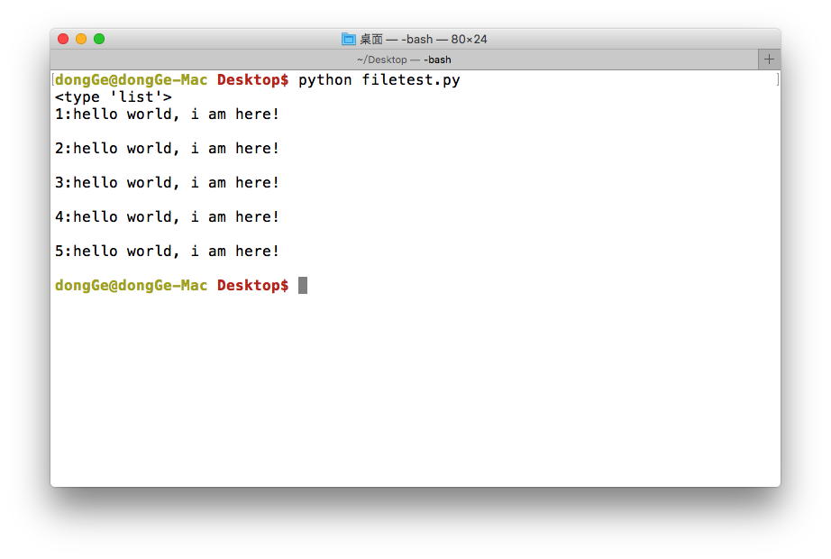
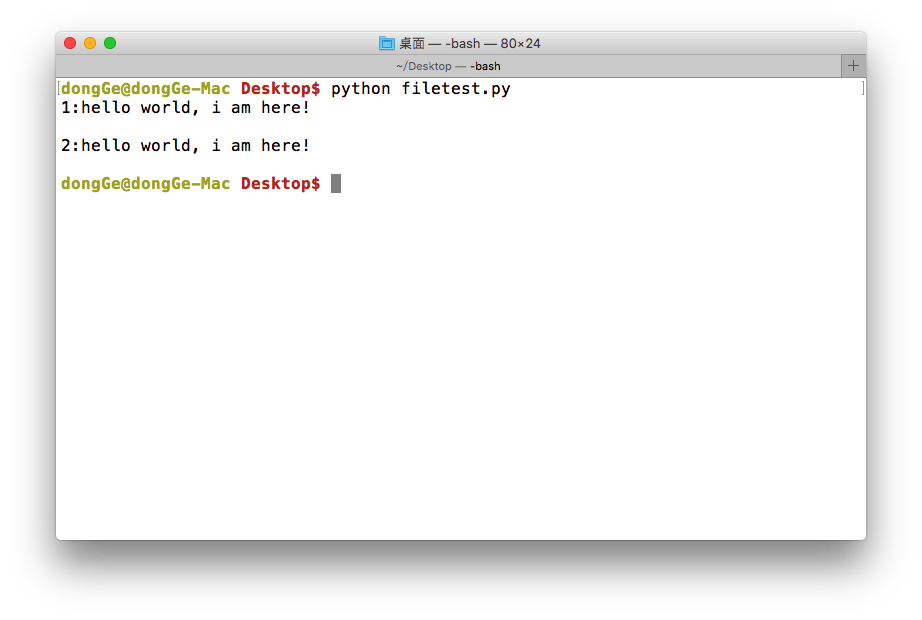
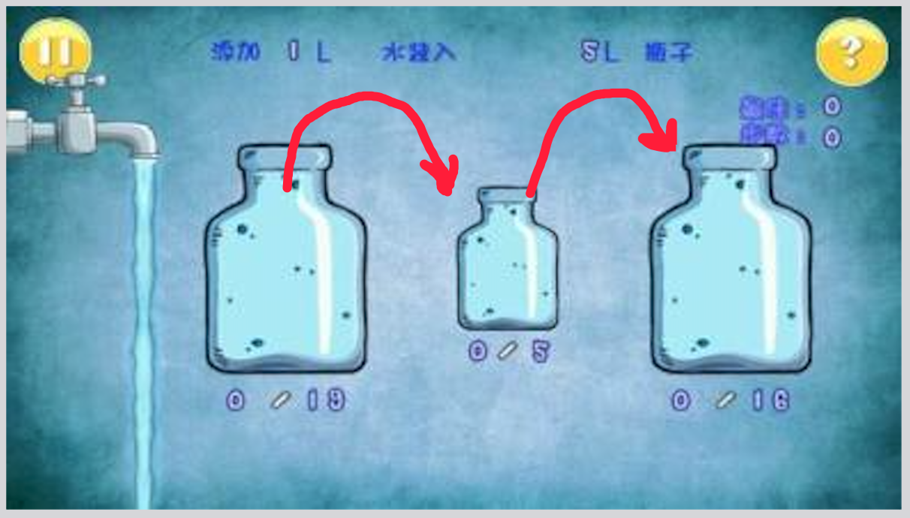

## 文件的读写

### <1>写数据(write)

使用write()可以完成向文件写入数据

demo: 新建一个文件 `file_write_test.py`,向其中写入如下代码:

```python

f = open('test.txt', 'w')
f.write('hello world, i am here!')
f.close()
```

运行之后会在`file_write_test.py`文件所在的路径中创建一个文件`test.txt`,其中数据如下:



注意：

+ 如果文件不存在那么创建，如果存在那么就先清空，然后写入数据


### <2>读数据(read)

使用read(num)可以从文件中读取数据，num表示要从文件中读取的数据的长度（单位是字节），如果没有传入num，那么就表示读取文件中所有的数据

demo: 新建一个文件`file_read_test.py`，向其中写入如下代码:

```python

f = open('test.txt', 'r')
content = f.read(5)  # 最多读取5个数据
print(content)

print("-"*30)  # 分割线，用来测试

content = f.read()  # 从上次读取的位置继续读取剩下的所有的数据
print(content)

f.close()  # 关闭文件，这个可以是个好习惯哦
```

运行现象：

```
hello
------------------------------
 world, i am here!
```

注意：

+ 如果用open打开文件时，如果使用的"r"，那么可以省略，即只写 `open('test.txt')`


### <3>读数据（readlines）

就像read没有参数时一样，readlines可以按照行的方式把整个文件中的内容进行一次性读取，并且返回的是一个列表，其中每一行的数据为一个元素

```python
#coding=utf-8

f = open('test.txt', 'r')
content = f.readlines()
print(type(content))

i=1
for temp in content:
	print("%d:%s" % (i, temp))
	i += 1

f.close()
```

运行现象：


	

### <4>读数据（readline）

```python
#coding=utf-8

f = open('test.txt', 'r')

content = f.readline()
print("1:%s" % content)

content = f.readline()
print("2:%s" % content)


f.close()
```



### 想一想：
如果一个文件很大，比如5G，试想应该怎样把文件的数据读取到内存然后进行处理呢？



